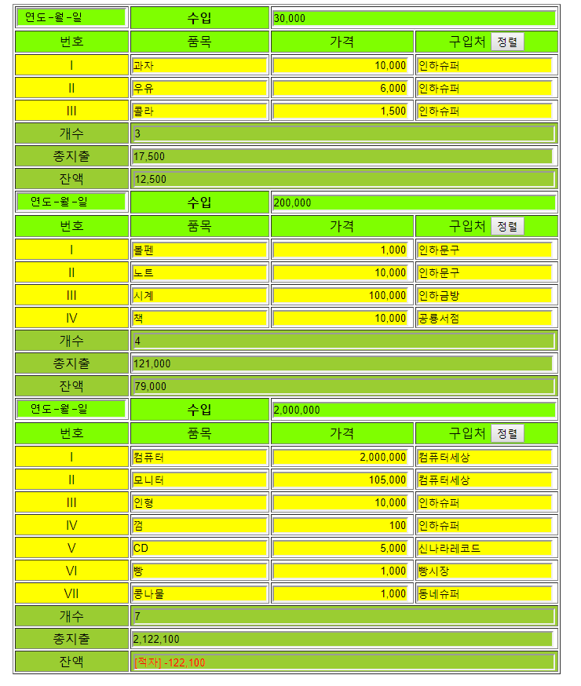
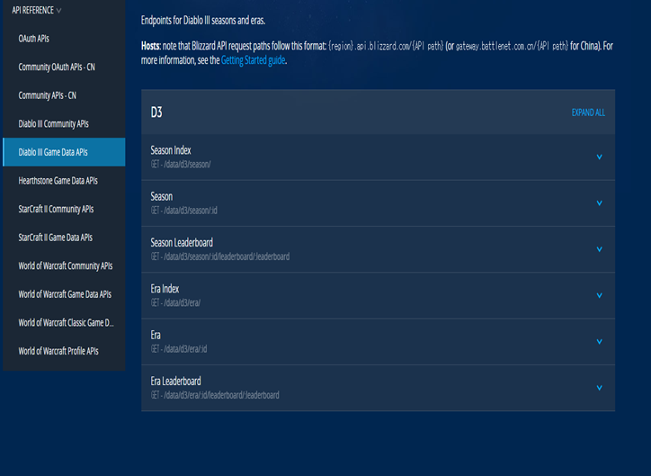
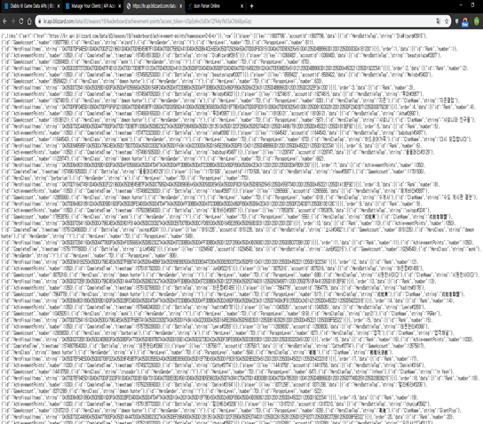
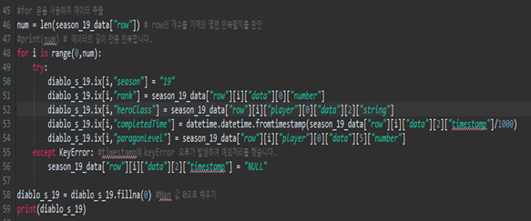
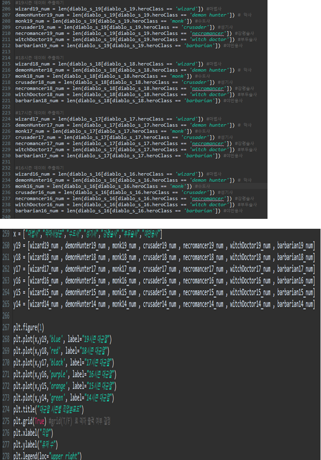
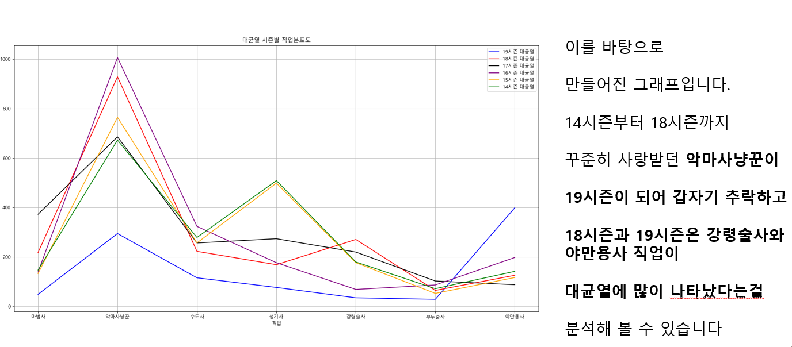
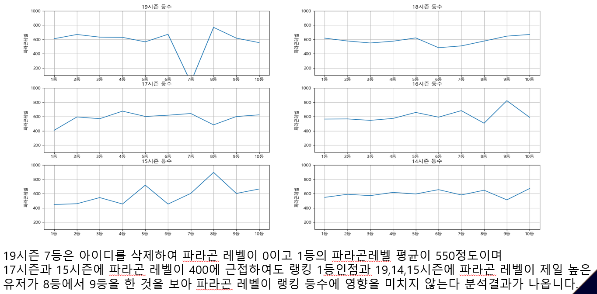

# SchoolClass

1. **2019.12.28**
* 학교 수업프로젝트 업로드

2. **2019.12.28**
* 프론트엔드 수업 과제 업로드
* 비쥬얼코드를 이용한 코딩 HTML,CSS,JAVASCRIPT를 사용

3. **2020.04.06**
* 블리자드 api를 이용한 프로젝트 업로드
* 이클립스 파이썬으로 진행

+ 블리자드에서 제공하는 오픈api를 받는 장면

+ 제공 받은 api를 출력했을 때 나오는 json 파일 형식입니다

+ 대균열 시즌의 랭킹 데이터를 처리하는 코드입니다

+ 대균열에 나오는 직업 분포도에 직업 데이터를 시각화 합니다

+ 데이터 시각 결과와 작업으로 인해 얻을 수 있었던 결과 값

+ 데이터 시각 결과와 작업으로 인해 얻을 수 있었던 결과 값 2

+ 자세한 내용은 폴더 안 pptx를 확인 해주세요.